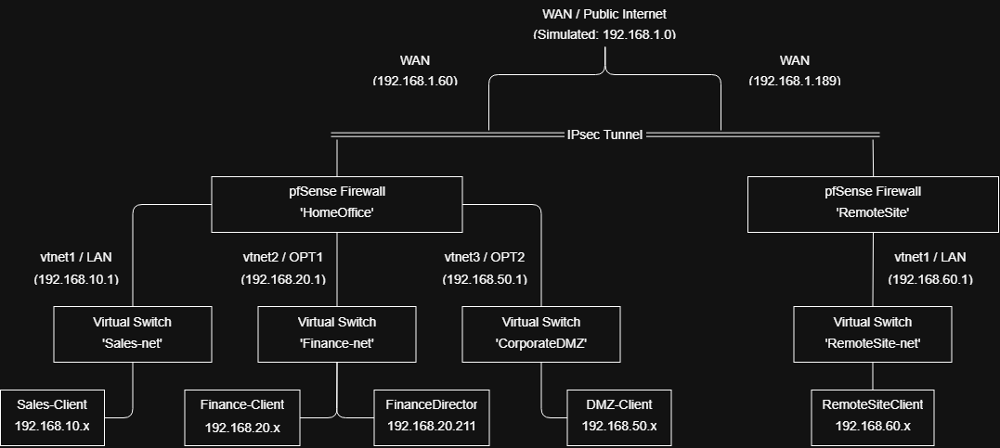
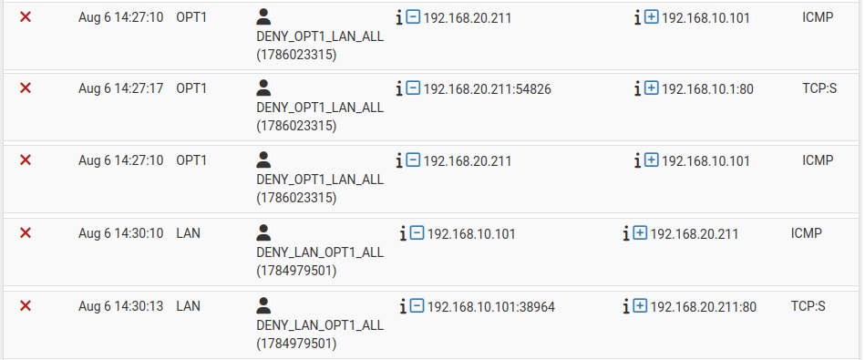
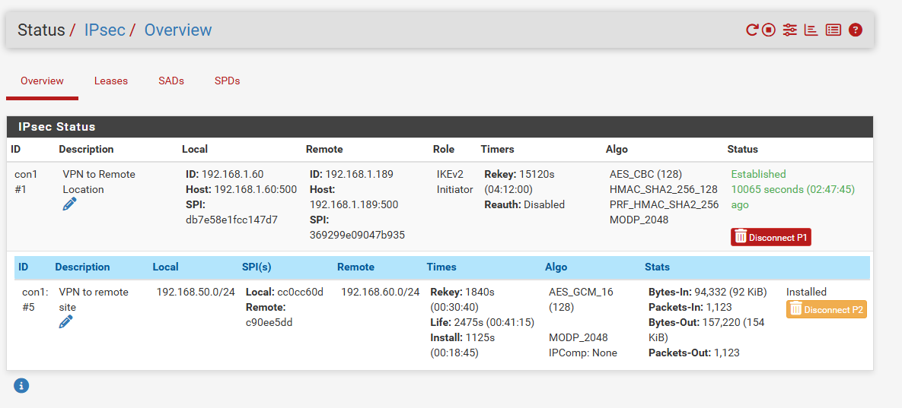
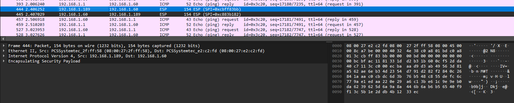
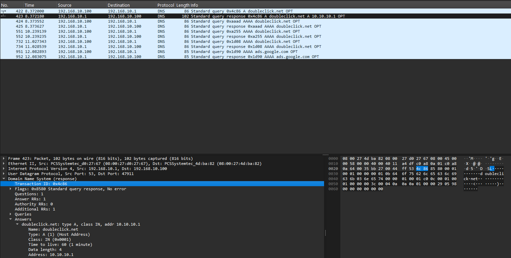
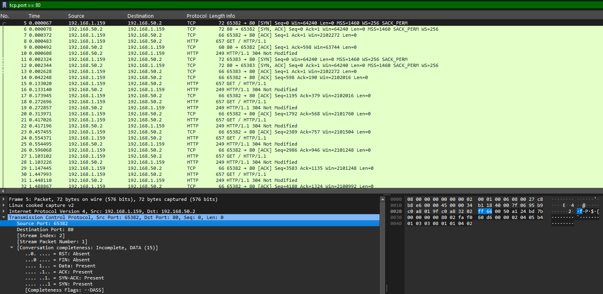

# Enterprise Multi-Site Network & Security Lab

## Overview
A virtualized, multi-zone enterprise network architecture built using **pfSense 2.8**, **Oracle VirtualBox**, and **Lubuntu**. This project demonstrates multi-site connectivity via an IKEv2 IPsec VPN, strict network segmentation, DNS-level threat filtering, and public service publishing via NAT.

---

## Network Architecture Topology

### Network Segmentation & Subnets
| Zone / Site | Interface | Subnet | Description |
| :--- | :--- | :--- | :--- |
| **WAN Cloud** | `vtnet0` | `192.168.1.0/24` | Simulated Public Internet / Gateway |
| **HomeOffice - LAN** | `vtnet1` | `192.168.10.0/24` | Internal Sales Network |
| **HomeOffice - OPT1** | `vtnet2` | `192.168.20.0/24` | Restricted Finance Network |
| **HomeOffice - OPT2** | `vtnet3` | `192.168.50.0/24` | Isolated DMZ (Nginx Web Server) |
| **RemoteSite - LAN** | `vtnet1` | `192.168.60.0/24` | Branch Office Client Network |

---

## Key Features & Security Policies

* **IKEv2 Site-to-Site IPsec VPN:** Connects `HomeOffice` (`192.168.1.60/24`) and `RemoteSite` (`192.168.1.189/24`) over Phase 1/Phase 2 tunnels with AES-CBC (Phase 1) / AES-GCM (Phase 2) encryption.
* **DNSBL Threat Filtering (pfBlockerNG):** Implemented DNS-layer sinkholing to block known malicious domains and enforce organizational access control policies (blocking high-bandwidth and social media platforms).
* **Web Publishing (NAT Port Forwarding):** Port-forwarding WAN port 80 to an isolated Nginx Web Server inside the Corporate DMZ.
* **Granular Firewall Policy:** Enforces default-deny rulebases between internal VLANs/subnets to prevent unauthorized lateral movement.

---

## Verification & Traffic Analysis (Wireshark & Logs)

### 1. Inter-VLAN Segmentation Verification
Strict inter-VLAN routing rules were implemented in pfSense to enforce zero-trust network boundaries between internal networks. The Finance (OPT1) and Sales (LAN) networks are fully isolated from one another, preventing any direct communication or lateral movement between departments — even though both sit behind the same firewall.

*Live firewall logs showing the default-deny policy actively blocking cross-VLAN traffic — ICMP and TCP:SYN packets between the Finance (OPT1) and Sales (LAN) networks are denied in real time:*

### 2. Site-to-Site IPsec VPN Validation
The IKEv2 tunnel was verified active between WAN endpoints `192.168.1.60` and `192.168.1.189`. 

*pfSense IPsec status page showing the Phase 1 and Phase 2 tunnel as Established, with live encryption parameters and traffic counters:*

*Wireshark capture showing ESP-encrypted traffic crossing the simulated WAN during cross-tunnel pings:*

### 3. DNSBL Sinkhole Proof
DNS queries from internal clients for restricted domains return the local sinkhole loopback address, preventing outbound connections.

*Wireshark capture showing a DNS query for a blocklisted domain resolving to the local sinkhole address instead of its real IP, confirming the block is active:*

### 4. NAT Port Forwarding & Web DMZ Verification
Inbound web traffic destined for the firewall's WAN address is redirected via NAT to the internal DMZ web server, allowing external clients to reach an internally-hosted service without directly exposing it.

*Wireshark capture confirming inbound HTTPS/HTTP traffic correctly NAT'd from WAN to the DMZ web server:*

---

## Tools & Technologies Used
* **Firewalls / Routers:** pfSense 2.8.1 (FreeBSD)
* **Virtualization:** Oracle VirtualBox (Internal Networks)
* **Packet Analysis:** Wireshark
* **Services:** Nginx, OpenSSL, pfBlockerNG, Unbound DNS
